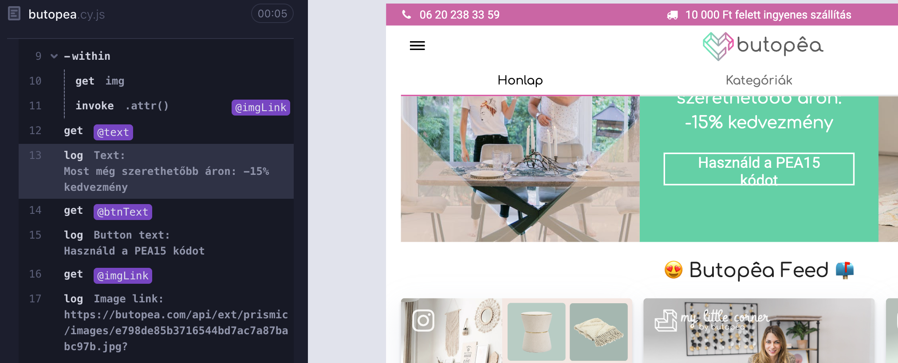

# Introduction
In this project I've created a few tests for a popular end-to-end testing framework known as `Cypress`.
There are two test cases in this project:

1. Main page layout test
2. Product page test
   
# Requirements
- `Node.js` version 12.x or higher
- `npm`
  
# Setup
To set up the code, follow these steps:

1. Navigate to the project folder: 
   ```shell
   cd butopea-task02
   ```
2. Run the following command to install the dependencies:
    ```shell
    npm install
    ```

# Running the Code
There are two ways to run the tests:
1. Run tests via cli:
   ```shell
   npx cypress run -b chrome
   ```
   This command will run tests in headless mode in Chrome browser.
2. Run tests via **Cypress GUI**:
   ```shell
    npx cypress open
    ```
    This command will open **Cypress GUI** where you can select the test you want to run.
    
    1. Select `E2E Testing`
    2. Start `E2E Testing` session in Chrome browser
    3. Select `butopea.cy.js` file to run the tests
    4. Wait for the tests to finish

# Code explanation
I've added base url to `cypress.config.json` file:
```javascript
baseUrl: "https://butopea.com"
```
This way I can perform requests in a more concise way:
```javascript
cy.visit("/")   // navigates to https://butopea.com/
```
And also access the base url from anywhere in the code:
```javascript
Cypress.config().baseUrl    // https://butopea.com
```

This code snippet is used to navigate to the main page before each test:
```javascript
// ...
beforeEach(() => {
    cy.visit("/");
  });
// ...
```
## Main page layout test
The code block below shows most of the functionality of **Cypress** used throughout the project:
```javascript
// ...
cy.get("div.banner-square-overlay-container").within(() => {
      cy.get("p").invoke("text").as("text");
      cy.get("button").invoke("text").as("btnText");
    }); 
// ...
```
- `cy.get()` is used to select an element on the page.
- `within()` is used to select an element within the previously selected element.
- `invoke()` is used to get/call properties of an element, which are functions, like `text()`.
- `as()` is used to save elements or their properties for later use.


## Product page test
This test is a bit more complex than the previous one. It uses a few more **Cypress** functions:
```javascript
// ...
products.each((index, product) => {
    cy.wrap(product).within(() => {
        cy.get(".product-tile-info").within(() => {
            cy.get("p").invoke("text").as("productName");
            cy.get("div").invoke("text").as("productPrice");
        });
    });
    // ...
});
// ...
```
- `each()` is used to iterate through a list of elements.
- `wrap()` is used to wrap an element, kind of focus on it, so that **Cypress** commands can be used on it.
  
---
I can't really say anything more about this tests. Queries to the DOM are quite simple, rather by tag name, selector, id or class name.

# Results
## CLI output:
```shell

DevTools listening on ws://127.0.0.1:59006/devtools/browser/64519116-0c5c-4dcc-93e4-bd0972d8baac

===============================================================================================

  (Run Starting)

  ┌────────────────────────────────────────────────────────────────────────────────────────────────┐
  │ Cypress:        13.3.3                                                                         │
  │ Browser:        Chrome 118 (headless)                                                          │
  │ Node Version:   v20.8.0 (/opt/homebrew/Cellar/node/20.8.0/bin/node)                            │
  │ Specs:          1 found (butopea.cy.js)                                                        │
  │ Searched:       cypress/e2e/**/*.cy.{js,jsx,ts,tsx}                                            │
  └────────────────────────────────────────────────────────────────────────────────────────────────┘


────────────────────────────────────────────────────────────────────────────────────────────────────

  Running:  butopea.cy.js                                                                   (1 of 1)


  butopea test
    ✓ square with text n button (1663ms)
    ✓ products (2933ms)


  2 passing (5s)


  (Results)

  ┌────────────────────────────────────────────────────────────────────────────────────────────────┐
  │ Tests:        2                                                                                │
  │ Passing:      2                                                                                │
  │ Failing:      0                                                                                │
  │ Pending:      0                                                                                │
  │ Skipped:      0                                                                                │
  │ Screenshots:  0                                                                                │
  │ Video:        false                                                                            │
  │ Duration:     5 seconds                                                                        │
  │ Spec Ran:     butopea.cy.js                                                                    │
  └────────────────────────────────────────────────────────────────────────────────────────────────┘


===============================================================================================

  (Run Finished)


       Spec                                              Tests  Passing  Failing  Pending  Skipped
  ┌────────────────────────────────────────────────────────────────────────────────────────────────┐
  │ ✔  butopea.cy.js                            00:05        2        2        -        -        - │
  └────────────────────────────────────────────────────────────────────────────────────────────────┘
    ✔  All specs passed!                        00:05        2        2        -        -        -
```

## Cypress GUI output:

### Final result:


### Data extracted from main page:


### Piece of data extracted from product page:


# Sources
- [Cypress Docs](https://docs.cypress.io/)
- [Cypress API](https://docs.cypress.io/api/api/table-of-contents.html)
